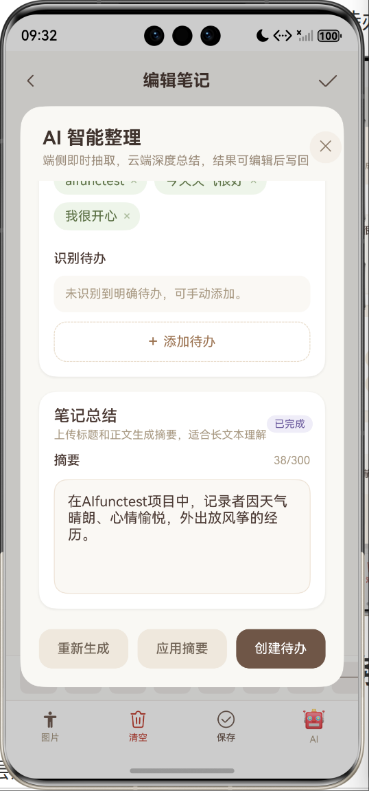

[TOC]

# 🦙 Llama Llist – 灵感笔记与待办清单

> 一个集笔记记录与任务管理于一体的效率工具。支持多模态笔记、标签分类、待办状态机、搜索筛选，并为后续 AI 功能预留扩展点。

## 一、技术栈

| 层级 | 技术 |
|------|------|
| 前端 | HarmonyOS ArkUI (ArkTS) 声明式语法 |
| 后端 | Python + FastAPI + SQLAlchemy (异步) |
| 数据库 | SQLite (开发环境) / PostgreSQL (生产可选) |
| 通信 | HTTP + JSON (RESTful API) |
| 文档 | FastAPI 自动生成 OpenAPI (Swagger) |

## 二、目前完成的功能

### 1. 多模态笔记

- 支持文字标题、摘要、长文内容，摘要可在笔记卡片中直接展示
- 支持插入图片：相册选图、拍照（模拟器占位）、URL 粘贴，图片以三列网格呈现，支持快速删除
- 富文本快捷工具栏：加粗、三级标题、分割线、插入时间戳、字体颜色、注意标识、引用标识
- 模板系统：内置读书笔记、心情随笔、会议记录三种预设模板，编辑时弹出选择框一键填充
- 左滑卡片快捷删除；标题为空时保存前校验拦截（前端 + 后端双重校验）

### 2. 分类/标签管理

- 支持标签新增、列表展示、删除
- 笔记可绑定标签，首页标签栏支持左右滑动筛选，末尾提供快捷新增/管理入口

### 3. 待办状态机

- 三态切换：`pending（待处理）`/ `completed（已完成）`/ `delayed（已延期）`
- 截止日期选择器，状态根据当前时间动态自动更新（过期自动变为已延期）
- 四级紧急程度：`紧急重要` / `紧急不重要` / `不紧急重要` / `不紧急不重要`，各对应独立颜色标签
- 卡片内快速切换状态与紧急程度；支持按状态 + 优先级双层筛选

### 4. 搜索功能

- 关键字搜索（匹配标题与正文内容）
- 日期范围筛选（`created_from` ～ `created_to`）
- 标签筛选；首页顶部提供快速搜索入口

### 5. 主题换肤

- 五套内置主题：原野棕、晴空蓝、嫩芽绿、樱花粉、薰衣草紫
- 主题颜色从后端读取，切换后通过 `AppStorage` 全局同步，所有页面（欢迎页、笔记页、编辑页、搜索页、标签页、待办页）背景色与主色实时响应
- 在「行囊」模块点击「主题装扮」弹出选择面板，当前主题高亮显示

### 6. AI 功能（端侧 + 云端）

#### 端侧模型（本地抽取）

在笔记编辑页点击 AI 按钮，调用本地轻量算法对笔记内容进行分析，**无需网络即可运行**：

| 功能       | 实现方式                                    |
| ---------- | ------------------------------------------- |
| 关键词提取 | 词频统计 + 停用词过滤                       |
| 标签生成   | 取前 3 个高频关键词                         |
| 待办识别   | 正则匹配（checkbox / dash / todo 等关键词） |
| 优先级判断 | 关键词匹配（urgent / important / asap 等）  |

API 端点：

```
POST /notes/{note_id}/ai/extract
```

#### 云端大模型（在线摘要）

同一弹窗内，端侧抽取完成后自动继续调用云端接口，进行更高质量的长文摘要与关键词增强，**失败时自动降级保留端侧结果并提示用户**：

- 生成自然语言摘要（可编辑）
- 增强关键词列表
- 提取待办事项

API 端点：

```
POST /notes/{note_id}/ai/summarize
```

云端服务的 Provider URL 与 API Key 可在「行囊 → 设置中心」中配置，无需重新编译。

#### AI 结果落地

AI 建议弹窗内的所有结果均可编辑，并通过以下操作写回应用：

- **应用摘要**：将生成的摘要写回笔记摘要字段并保存
- **作为待办**：将识别出的待办项批量创建到待办看板
- **关键词**：可在弹窗内增删，后续可用于标签推荐

## 三、目录结构
```
llama-llist/
├── frontend/                                 # HarmonyOS 工程（用 DevEco Studio 打开）
│   └── entry/src/main/ets/
│       ├── pages/                            # 页面
│       │   ├── Index.ets                     # 笔记列表页 
│       │   ├── NoteEdit.ets                  # 新增/编辑笔记页 
│       │   ├── TagManage.ets                 # 标签管理页 
│       │   ├── TodoBoard.ets                 # 待办看板页
│       │   ├── SearchPage.ets                # 搜索筛选页 
|       |   └── SplashPage.ets                # 欢迎页
│       ├── common/                           # 公共模块
│       │   ├── network/
│       │   │   └── httpClient.ets            # HTTP 请求封装 
│       │   ├── constants/
│       │   │   └── Config.ets                # 全局配置（BASE_URL等）
│       │   └── utils/                        # 工具函数（日期格式化等）⏳
│       ├── models/                           # 数据模型
│       │   ├── Note.ets                      # 笔记模型 
│       │   ├── Tag.ets                       # 标签模型 
│       │   └── Todo.ets                      # 待办模型 
│       └── database/                         # 本地数据库（本次作业未使用，为后续预留）
├── backend/                                  # Python 后端
│   ├── app/
│   │   ├── __init__.py
│   │   ├── main.py                           # FastAPI 入口（含 CORS、日志中间件
│   │   ├── database.py                       # 数据库连接（异步 SQLite）
│   │   ├── models.py                         # SQLAlchemy 模型（Note, Tag, Todo）
│   │   ├── schemas.py                        # Pydantic 模型（Note, Tag, Todo）
│   │   ├── crud.py                           # 数据库操作（Note/Tag/Todo CRUD）
│   │   └── routers/                          # 路由模块
│   │       ├── __init__.py
│   │       ├── notes.py                      # 笔记相关 API 
│   │       ├── tags.py                       # 标签相关 API 
│   │       ├── todos.py                      # 待办相关 API 
|   |       ├── templates.py                  # 模板相关 API
│   │       └── files.py                      # 图片上传 API 
│   ├── uploads/                              # 用户上传图片目录（自动生成）
│   ├── notes.db                              # SQLite 数据库文件（自动生成）
│   ├── requirements.txt                      # Python 依赖 
│   ├── .env                                  # 环境变量（可选，不提交）
│   └── config.py                             # 配置管理（可选，已规划）
├── docs/                                     # 文档
│   ├── API.md                                # 接口文档（待补充）
│   └── architecture.png                      # 架构图（待补充）
├── .gitignore                                # Git 忽略规则 
└── README.md                                 # 项目说明 
```


## 四、启动指南

### 1. 后端启动


1. **进入后端目录**
   ```bash
   cd backend

2. **创建并激活虚拟环境**
   ```bash
    Windows (PowerShell):
    python -m venv venv
    .\venv\Scripts\Activate.ps1
   
    macOS/Linux:
    python3 -m venv venv
    source venv/bin/activate

3. **安装依赖**
   ```bash
   pip install -r requirements.txt

4. **启动服务**
   ```bash
   uvicorn app.main:app --reload --host 0.0.0.0 --port 8000 --log-level warning

### 2. 前端启动


1. **使用 DevEco Studio 打开项目**  
   选择 `Open Project`，定位到 `frontend` 目录。


2. **配置 hdc 环境变量（用于端口转发或设备连接）**  
- 请确保安装了**OpenHarmony SDK**


- 找到 HarmonyOS SDK 安装目录下的 `toolchains` 文件夹（默认 `C:\Users\你的用户名\AppData\Local\Huawei\Sdk\openharmony\20\toolchains`）。  
- 将该路径添加到系统 `PATH` 环境变量中，或者在使用 `hdc` 命令时使用绝对路径。  
- 验证配置：打开新终端，输入 `hdc list targets`，应显示已连接的设备（模拟器或真机）。

3. **运行应用**  
   - 连接真机或启动模拟器（推荐 API 12+）。  
   - 点击 DevEco Studio 的运行按钮，等待安装并启动。

## 五、页面设计
### 1. 欢迎页
Logo + 标语淡入动画，2.5 秒后自动跳转主页，背景色跟随当前主题。


### 2. Llama Meadow 草原---笔记区


顶部：标题/标语 + 搜索快捷键
标签栏：左右滑动筛选，末尾提供新增/管理标签快捷入口


笔记列表：上下滚动，左滑出现删除键，卡片显示标题、摘要、标签与时间
右下角：新建笔记悬浮按钮


---

新建笔记页面：

返回键 / 确认键 → 标题 → 摘要 → 标签选择 → 正文 → 富文本工具栏（含模板选择）→ 底部功能栏（图片 / AI建议 / 清空 / 保存）


分为摘要（云端 · 暖棕色条）、关键词（端侧 · 淡紫色条）、待办（端侧 · 灰绿色条）三个区块，结果可编辑，支持应用摘要、作为待办写回。




### 3. Llama Peak   山峰---任务区

标题和标语 
双层选择【状态和优先级】
任务卡片
右下角新建待办


---

从上到下依次为：标题、截止日期、重要紧急程度设置、确认

### 4. Llama Pack   行囊---管理区

| 入口       | 功能                                     |
| ---------- | ---------------------------------------- |
| 🏷️ 标签管理 | 跳转标签管理页，支持新增/删除标签        |
| 🔍 笔记搜索 | 跳转搜索页，支持关键字 + 日期 + 标签筛选 |
| 🎨 主题装扮 | 弹出主题选择面板，切换后全局生效         |
| ⚙️ 设置中心 | 配置云端 AI 的 Provider URL 与 API Key   |


## 六、API 接口概览

| 方法   | 路径                        | 说明                              | 状态码 |
| ------ | --------------------------- | --------------------------------- | ------ |
| GET    | `/`                         | 健康检查                          | 200    |
| GET    | `/notes/`                   | 获取笔记列表（支持分页/搜索筛选） | 200    |
| POST   | `/notes/`                   | 创建新笔记                        | 201    |
| GET    | `/notes/{id}`               | 获取单条笔记                      | 200    |
| PUT    | `/notes/{id}`               | 更新笔记                          | 200    |
| DELETE | `/notes/{id}`               | 删除笔记                          | 204    |
| POST   | `/notes/{id}/ai/extract`    | 端侧关键词/待办抽取               | 200    |
| POST   | `/notes/{id}/ai/summarize`  | 云端摘要生成                      | 200    |
| POST   | `/notes/{id}/ai/regenerate` | 重新生成端侧抽取结果              | 200    |
| GET    | `/tags/`                    | 获取所有标签                      | 200    |
| POST   | `/tags/`                    | 创建标签                          | 201    |
| DELETE | `/tags/{id}`                | 删除标签                          | 204    |
| GET    | `/todos/`                   | 获取待办列表（支持筛选）          | 200    |
| POST   | `/todos/`                   | 创建待办                          | 201    |
| PUT    | `/todos/{id}`               | 更新待办（状态机切换等）          | 200    |
| DELETE | `/todos/{id}`               | 删除待办                          | 204    |
| GET    | `/templates/`               | 获取模板列表                      | 200    |
| POST   | `/files/upload`             | 上传图片（返回 `/uploads/...`）   | 201    |
| GET    | `/settings/theme`           | 获取主题列表                      | 200    |
| GET    | `/settings/ai`              | 获取 AI 配置                      | 200    |
| POST   | `/settings/ai`              | 保存 AI Provider URL 与 Key       | 200    |
| ...    | ...                         | ...                               | ...    |

> 详细请求/响应格式请访问 `http://localhost:8000/docs`（后端启动后自动生成）

## 七、前端 BASE_URL 配置
- 统一在 common/constants/Config.ets 中修改 BASE_URL
- 使用的是虚拟网络，BASE_URL 固定为 http://10.0.2.2:8000，不需要修改

## 八、数据库现状与待完善之处

当前 `models.py` 包含以下数据表：

| 表名        | 说明                                                         |
| ----------- | ------------------------------------------------------------ |
| `notes`     | 笔记主表（标题、摘要、内容、图片路径、时间戳、标签外键、embedding 预留字段） |
| `tags`      | 标签表（名称唯一）                                           |
| `todos`     | 待办表（标题、状态、截止日期、关联笔记 ID、紧急程度）        |
| `templates` | 模板表（名称、分类、内容框架、图标），后端启动时自动初始化 3 条预设 |
| `themes`    | 主题表（5 套颜色方案），后端启动时自动初始化                 |
| `settings`  | 键值对设置表（存储 AI Provider URL、API Key 等）             |

**后续可完善的方向：**

| 方向           | 说明                                                         |
| -------------- | ------------------------------------------------------------ |
| 索引优化       | 为 `notes.created_at`、`todos.status`、`todos.deadline` 添加索引提升查询性能 |
| 级联删除       | `note_id` 外键添加 `ondelete="CASCADE"`，删除笔记时自动清理关联待办 |
| embedding 字段 | 当前为 `Text` 类型存 JSON 字符串，后续可改用向量数据库或专用扩展 |
| 图片存储       | `image_paths` 当前为逗号分隔路径，建议改为独立图片关联表     |
| 数据库迁移     | 生产环境建议引入 Alembic 进行版本化迁移管理                  |