[TOC]

# 🦙 Llama Llist – 灵感笔记与待办清单

> 一个集笔记记录与任务管理于一体的效率工具。支持多模态笔记、标签分类、待办状态机、搜索筛选，并为后续 AI 功能预留扩展点。

## 一、技术栈

| 层级 | 技术 |
|------|------|
| 前端 | HarmonyOS ArkUI (ArkTS) 声明式语法 |
| 后端 | Python + FastAPI + SQLAlchemy (异步) |
| 数据库 | SQLite (开发环境) / PostgreSQL (生产可选) |
| 通信 | HTTP + JSON (RESTful API) |
| 文档 | FastAPI 自动生成 OpenAPI (Swagger) |

## 二、目前完成的功能

1. **多模态笔记**
   - 支持文字标题、长文内容
   - 支持插入图片（以图片路径/URL 形式保存到 `image_paths` 字段，并在编辑页预览）
   - 增加了摘要部分，在笔记卡片中可以显示摘要部分
   - 增加了笔记的便携输入：加粗、三级标题、自动分割线、一键插入时间、字体颜色改变、注意标识、引用标识等
   - 增加了模板模块：根据不同类型的笔记，用户可以选择读书笔记、心情随笔、会议记录等模板
   - 增加了滑动删除功能，左滑卡片可以快捷删除卡片
   - 图片上传方式增加了相册上传功能和拍照【模拟机没有相机，该功能目前处于占位】，相册和URL上传的图片会在底部以三列滑动的方式呈现，支持快速删除
2. **分类/标签管理**
   - 支持标签的新增、列表、删除
   - 笔记支持选择标签并在列表展示，增加了滑动显示和首页快速增加
3. **待办状态机**
   - 待办支持 `pending（待处理）/ completed（已完成）/ delayed（已延期）` 三态切换
   - 支持按状态筛选、创建/删除待办（可选截止日期）
   - 改变了截止日期选择方式，并增加了根据时间确定是已延期还是待处理
   - 增加了紧急程度选择 `紧急重要` `紧急不重要` `不紧急重要` `不紧急不重要`，对应给了四个颜色
   - 增加了卡片快速更换状态和紧急程度变化 ，增加了状态根据时间动态自动更新
4. **搜索功能**
   - 支持按关键字（标题/内容）搜索笔记
   - 支持按日期范围（`created_from`～`created_to`）与标签筛选
   - 改变了日期选择方式，增加了首页快速搜索
   同时完成关键测试点：标题为空时保存校验拦截：前端保存前校验 + 后端二次校验（新建/更新均校验）。
## 三、目录结构
```
llama-llist/
├── frontend/                                 # HarmonyOS 工程（用 DevEco Studio 打开）
│   └── entry/src/main/ets/
│       ├── pages/                            # 页面
│       │   ├── Index.ets                     # 笔记列表页 
│       │   ├── NoteEdit.ets                  # 新增/编辑笔记页 
│       │   ├── TagManage.ets                 # 标签管理页 
│       │   ├── TodoBoard.ets                 # 待办看板页
│       │   ├── SearchPage.ets                # 搜索筛选页 
|       |   └── SplashPage.ets                # 欢迎页
│       ├── common/                           # 公共模块
│       │   ├── network/
│       │   │   └── httpClient.ets            # HTTP 请求封装 
│       │   ├── constants/
│       │   │   └── Config.ets                # 全局配置（BASE_URL等）
│       │   └── utils/                        # 工具函数（日期格式化等）⏳
│       ├── models/                           # 数据模型
│       │   ├── Note.ets                      # 笔记模型 
│       │   ├── Tag.ets                       # 标签模型 
│       │   └── Todo.ets                      # 待办模型 
│       └── database/                         # 本地数据库（本次作业未使用，为后续预留）
├── backend/                                  # Python 后端
│   ├── app/
│   │   ├── __init__.py
│   │   ├── main.py                           # FastAPI 入口（含 CORS、日志中间件
│   │   ├── database.py                       # 数据库连接（异步 SQLite）
│   │   ├── models.py                         # SQLAlchemy 模型（Note, Tag, Todo）
│   │   ├── schemas.py                        # Pydantic 模型（Note, Tag, Todo）
│   │   ├── crud.py                           # 数据库操作（Note/Tag/Todo CRUD）
│   │   └── routers/                          # 路由模块
│   │       ├── __init__.py
│   │       ├── notes.py                      # 笔记相关 API 
│   │       ├── tags.py                       # 标签相关 API 
│   │       ├── todos.py                      # 待办相关 API 
|   |       ├── templates.py                  # 模板相关 API
│   │       └── files.py                      # 图片上传 API 
│   ├── uploads/                              # 用户上传图片目录（自动生成）
│   ├── notes.db                              # SQLite 数据库文件（自动生成）
│   ├── requirements.txt                      # Python 依赖 
│   ├── .env                                  # 环境变量（可选，不提交）
│   └── config.py                             # 配置管理（可选，已规划）
├── docs/                                     # 文档
│   ├── API.md                                # 接口文档（待补充）
│   └── architecture.png                      # 架构图（待补充）
├── .gitignore                                # Git 忽略规则 
└── README.md                                 # 项目说明 
```


## 四、启动指南

### 1. 后端启动


1. **进入后端目录**
   ```bash
   cd backend

2. **创建并激活虚拟环境**
   ```bash
    Windows (PowerShell):
    python -m venv venv
    .\venv\Scripts\Activate.ps1
   
    macOS/Linux:
    python3 -m venv venv
    source venv/bin/activate

3. **安装依赖**
   ```bash
   pip install -r requirements.txt

4. **启动服务**
   ```bash
   uvicorn app.main:app --reload --host 0.0.0.0 --port 8000 --log-level warning

### 2. 前端启动


1. **使用 DevEco Studio 打开项目**  
   选择 `Open Project`，定位到 `frontend` 目录。


2. **配置 hdc 环境变量（用于端口转发或设备连接）**  
- 请确保安装了**OpenHarmony SDK**


- 找到 HarmonyOS SDK 安装目录下的 `toolchains` 文件夹（默认 `C:\Users\你的用户名\AppData\Local\Huawei\Sdk\openharmony\20\toolchains`）。  
- 将该路径添加到系统 `PATH` 环境变量中，或者在使用 `hdc` 命令时使用绝对路径。  
- 验证配置：打开新终端，输入 `hdc list targets`，应显示已连接的设备（模拟器或真机）。

3. **运行应用**  
   - 连接真机或启动模拟器（推荐 API 12+）。  
   - 点击 DevEco Studio 的运行按钮，等待安装并启动。

## 五、页面设计
### 1. 欢迎页
持续一段时间后进入主页

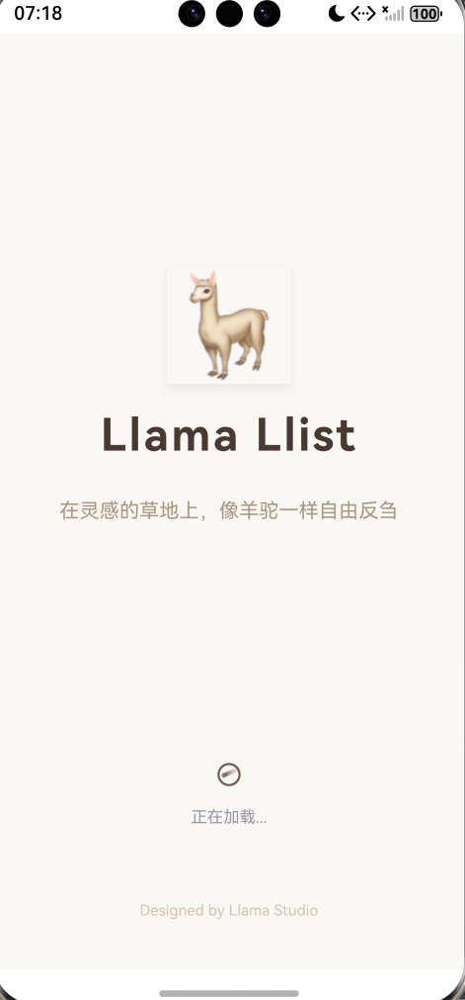

### 2. Llama Meadow 草原---笔记区

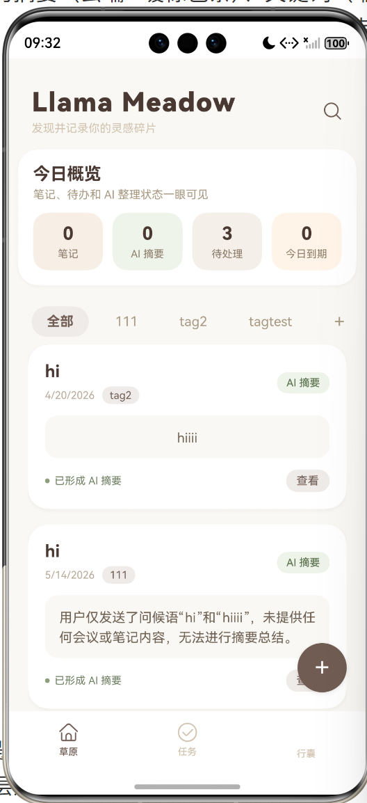

标题和标语    搜索键
标签呈现【左右滑动，最后是新增/管理标签快捷键】


笔记呈现【上下滑切换笔记，左滑出现删除键】
右下角新建笔记

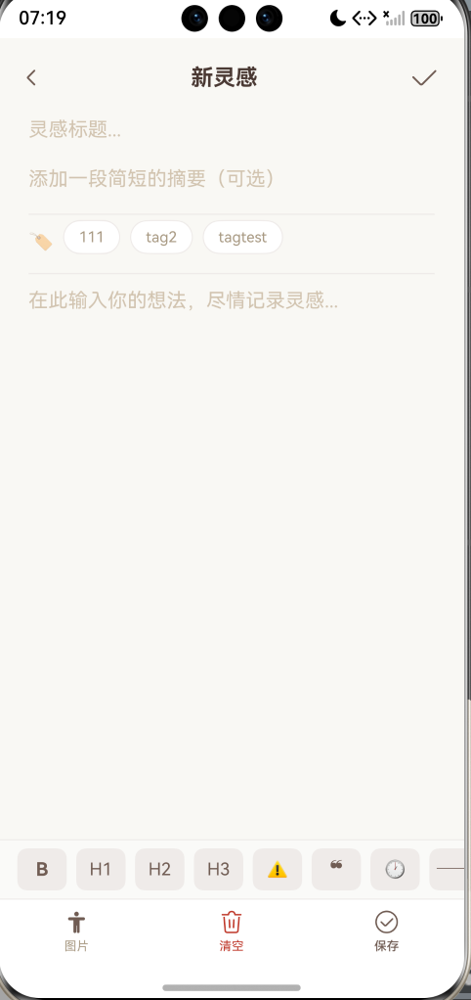

---

新建笔记页面：
返回 确认键
从上到下依次为：标题、摘要、标签、正文、文字输入功能区【模板放在该栏最后，使用时弹出小框】、笔记功能区【照片、清空和保存】

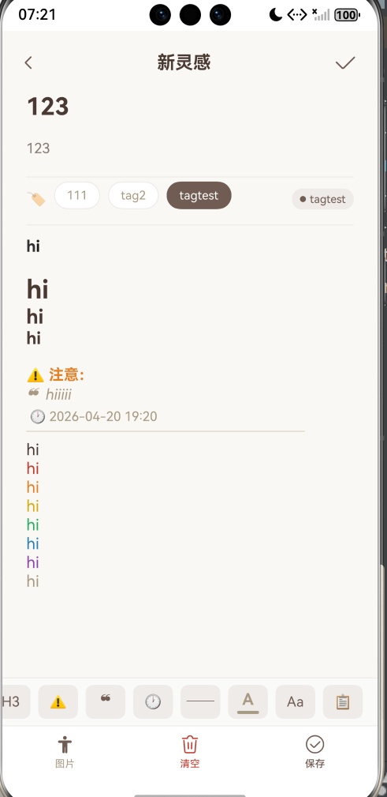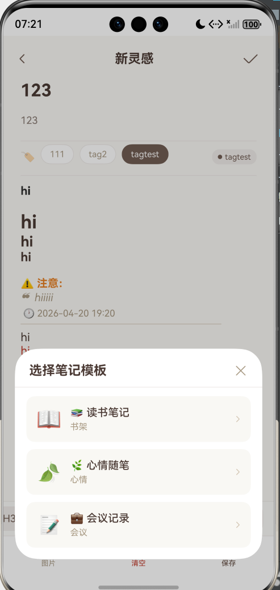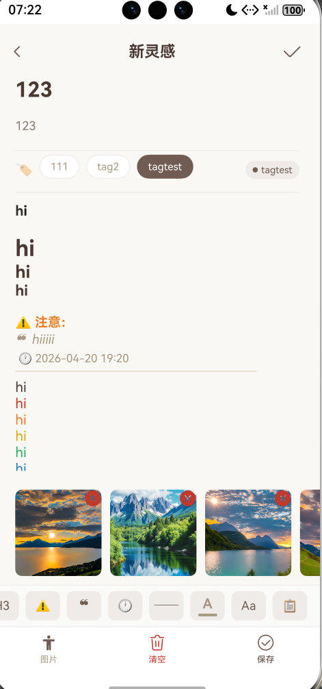

AI建议功能：

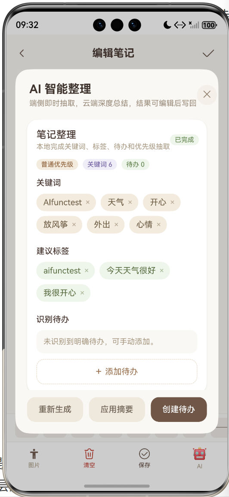


### 3. Llama Peak   山峰---任务区

标题和标语 
双层选择【状态和优先级】
任务卡片
右下角新建待办

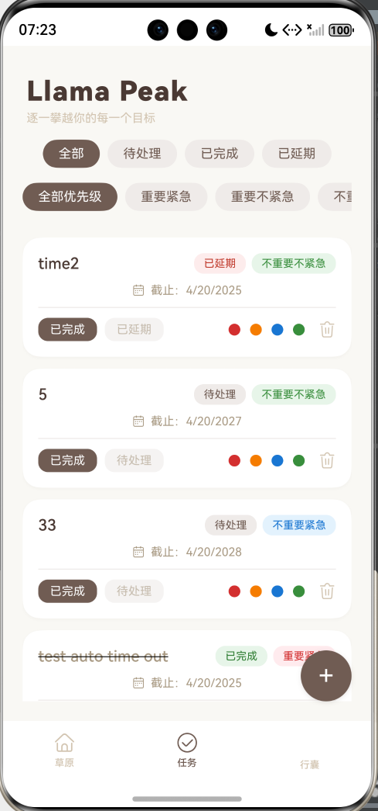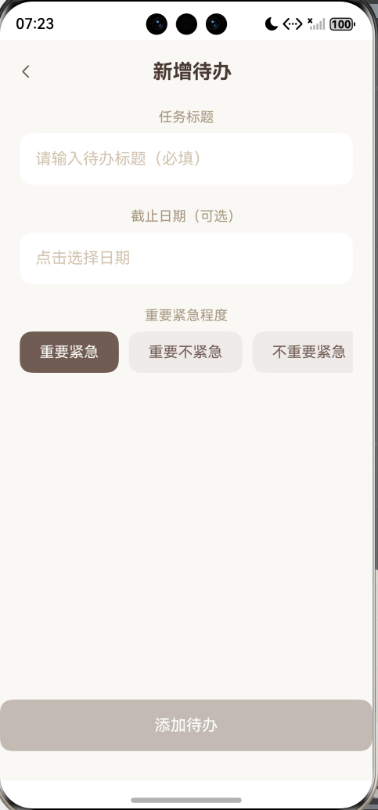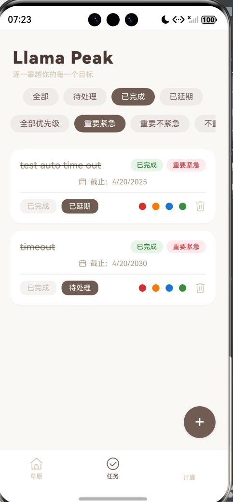


---

从上到下依次为：标题、截止日期、重要紧急程度设置、确认

### 4. Llama Pack   行囊---管理区

标题和标语
标签管理
笔记搜索
主题装扮【待实现】
设置中心【待实现】

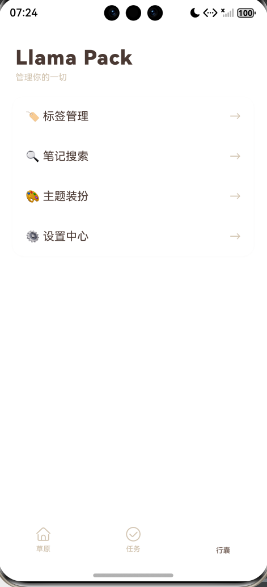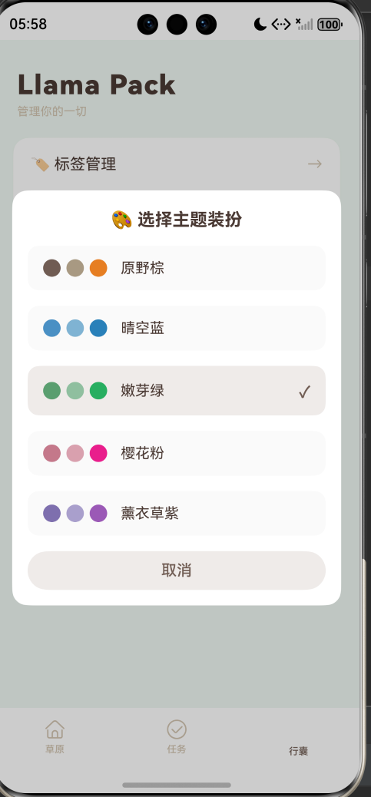


## 六、API 接口概览

| 方法   | 路径            | 说明                     | 状态码 |
|--------|----------------|--------------------------|--------|
| GET    | `/`            | 健康检查                 | 200    |
| GET    | `/notes/`      | 获取笔记列表（支持分页/搜索筛选） | 200    |
| POST   | `/notes/`      | 创建新笔记               | 201    |
| GET    | `/notes/{id}`  | 获取单条笔记             | 200    |
| PUT    | `/notes/{id}`  | 更新笔记                 | 200    |
| DELETE | `/notes/{id}`  | 删除笔记                 | 204    |
| GET    | `/tags/`       | 获取所有标签             | 200    |
| POST   | `/tags/`       | 创建标签                 | 201    |
| DELETE | `/tags/{id}`   | 删除标签                 | 204    |
| GET    | `/todos/`      | 获取待办列表（支持筛选） | 200    |
| POST   | `/todos/`      | 创建待办                 | 201    |
| PUT    | `/todos/{id}`  | 更新待办（状态机切换等） | 200    |
| DELETE | `/todos/{id}`  | 删除待办                 | 204    |
| POST   | `/files/upload`| 上传图片（返回 `/uploads/...`） | 201    |
| ...    | ...            | 更多接口见 `/docs`       | ...    |

> 详细请求/响应格式请访问 `http://localhost:8000/docs`（后端启动后）

## 七、前端 BASE_URL 配置
- 统一在 common/constants/Config.ets 中修改 BASE_URL
- 使用的是虚拟网络，BASE_URL 固定为 http://10.0.2.2:8000，不需要修改

## 八、数据库现状与待完善之处

当前 `models.py` 已包含以下表：

- `notes`：笔记主表（标题、概要、内容、图片路径、时间戳、标签外键、预留的 `embedding` 向量字段）
- `tags`：标签表（名称唯一）
- `todos`：待办表（标题、状态、截止日期、关联笔记 ID、紧急程度）
- `template`：模板（编号、名字、内容框架、图标等）

**已满足的功能**：笔记 CRUD（含搜索筛选）、标签管理、待办状态机（含筛选）。  
**后续可完善的方向**：

| 方向 | 说明 |
|------|------|
| **索引优化** | 为 `notes.created_at`、`todos.status`、`todos.deadline` 添加索引以提升查询性能 |
| **级联删除** | `note_id` 外键可添加 `ondelete="CASCADE"`，使删除笔记时自动删除关联的待办 |
| **embedding 字段** | 当前为 `Text` 类型，实际使用时需将向量序列化为 JSON 字符串；后续可改用 `Vector` 类型（需第三方扩展） |
| **图片存储** | `image_paths` 存储逗号分隔路径，建议改为一对多关联表，支持更灵活的图片管理 |
| **数据库迁移** | 目前使用 `Base.metadata.create_all`，生产环境建议引入 `Alembic` 进行版本化迁移 |

## 实现了的AI 扩展点
### 本地提取功能（端侧模型）

| 功能 | 实现方式 |
|------|------|
| 关键词提取| 词频统计 + 停用词过滤 |
| 标签生成 | 取前 3 个关键词 |
| Todo 识别 | 正则表达式匹配 (checkbox, dash, todo 关键词) |
| 优先级判断 |	关键词匹配（urgent, important, asap 等）|

API端点
```
POST /ai/local/extract/{note_id}
POST /notes/{note_id}/ai/extract
```

### 云端摘要功能
API端点
```
POST /ai/cloud/summarize/{note_id} 
POST /notes/{note_id}/ai/summarize
```
功能：可在“行囊”模块配置url和apikey
+ 生成摘要
+ 提取关键词
+ 提取标签
+ 提取Todo
可以应用摘要、标签、Todo等
重新生成可以再次调用尝试